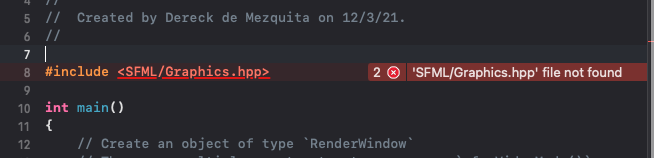
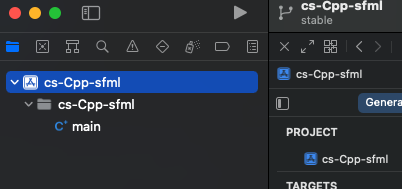
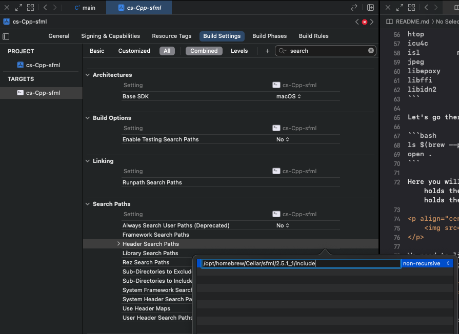
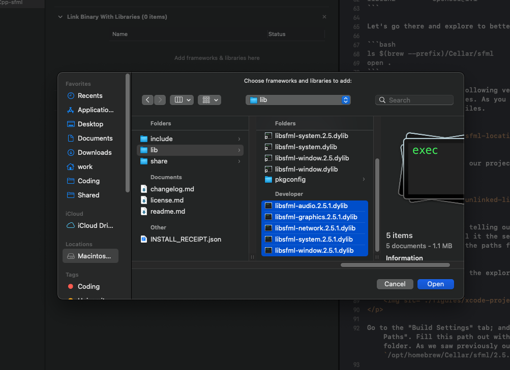
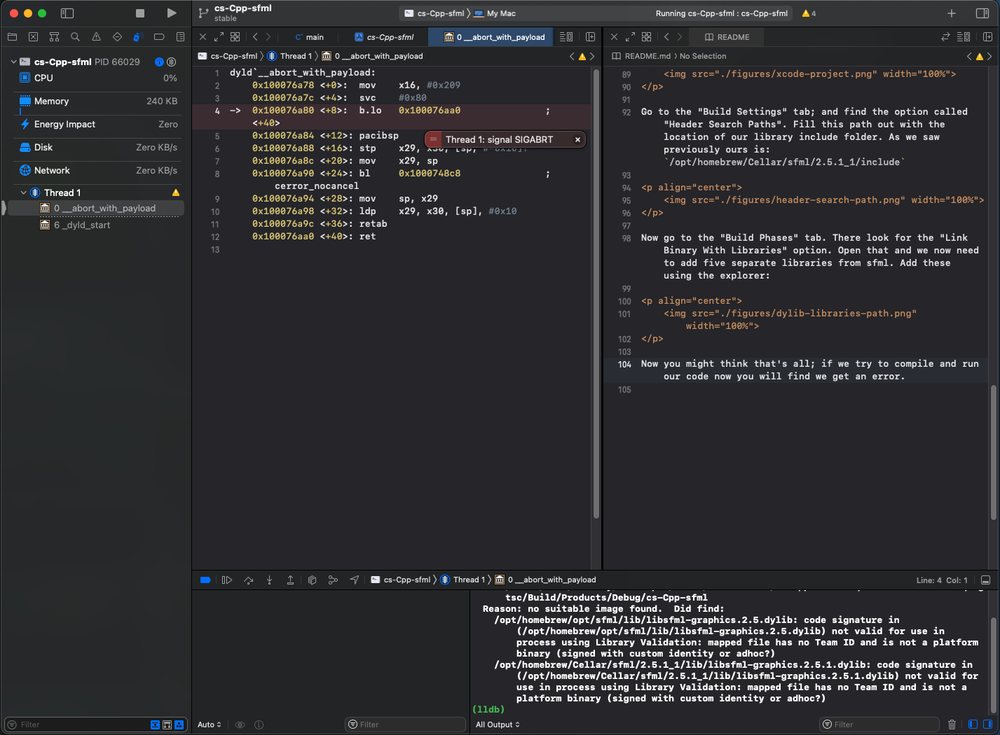
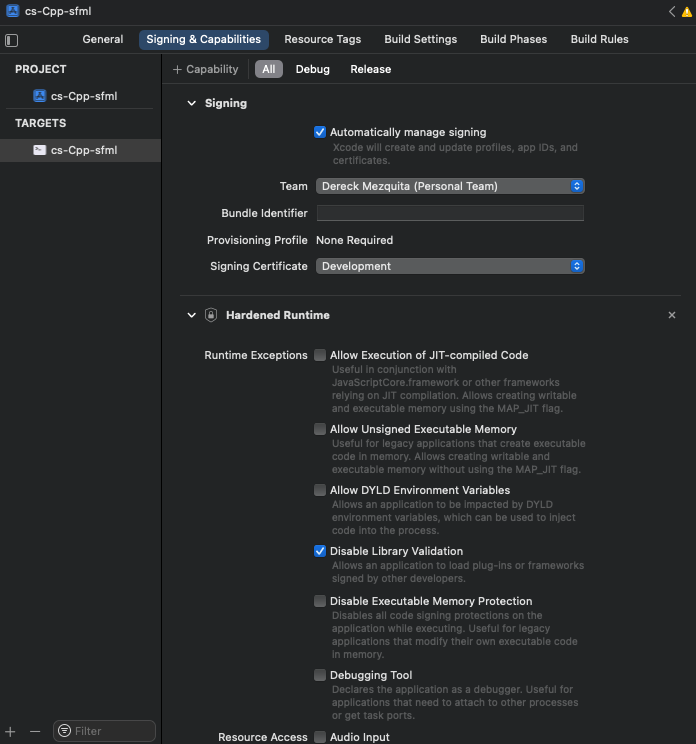
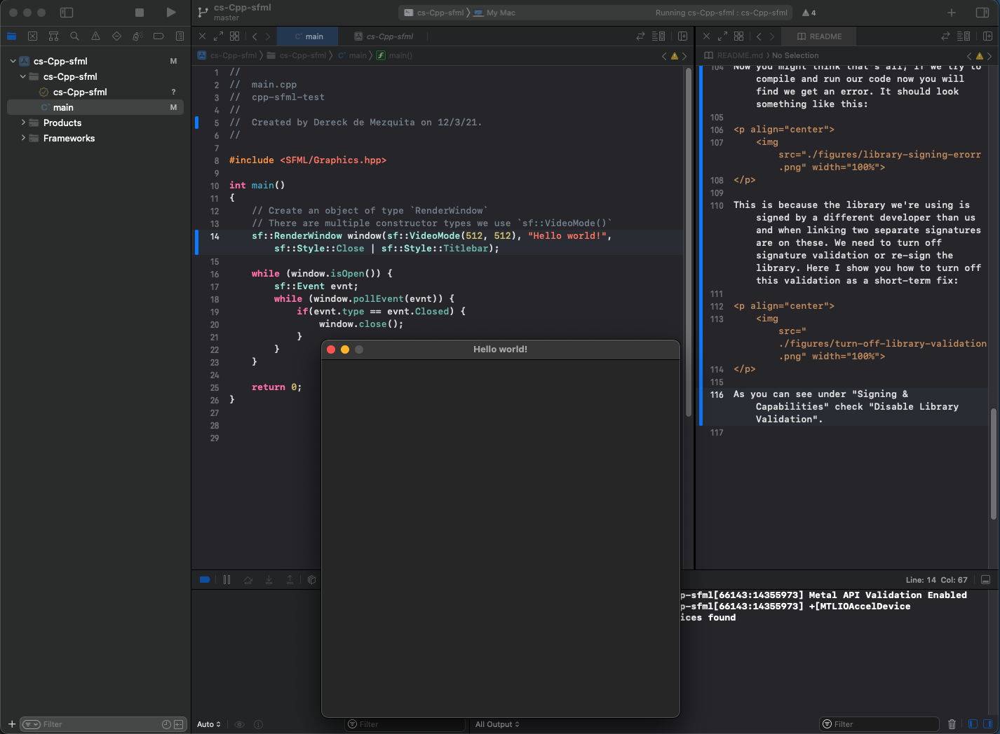
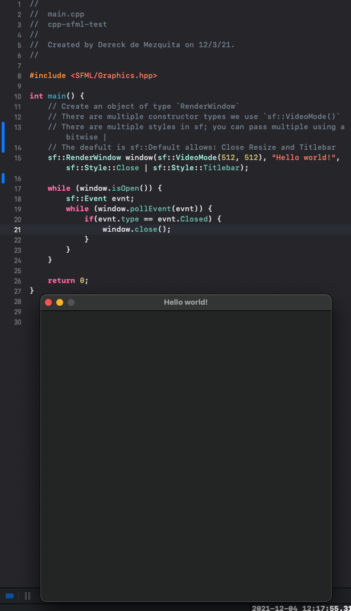
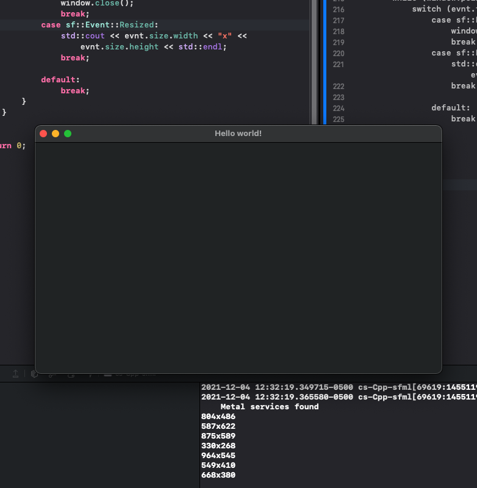

# Introduction to SFML (simple fast media library)

This is an introductory course on SFML (simple fast media library) for C++. SFML is a library that makes drawing to the screen nice and easy using C++.

It's cross platform and if you know anything about `canvas` in `JavaScript` then you know why you want to use this.

I am personally working on MacOS and will be using Xcode to do this work.

## Installing SFML

In order to see if our installation is working, I give you a small sample of code a small sfml hello world. Use this as a simple test for now and we will cover more on what each part does in the following sections:

```Cpp
#include <SFML/Graphics.hpp>

int main() {
    sf::RenderWindow window(sf::VideoMode(512, 512), "Hello world!", sf::Style::Close | sf::Style::Titlebar);

    while (window.isOpen()) {
        sf::Event evnt;
        while (window.pollEvent(evnt)) {
            if(evnt.type == evnt.Closed) {
                window.close();
            }
        }
    }

    return 0;
}
```

In order to install SFML I used `brew`. If you don't know what `brew` is you can find more information here: [brew.sh](https://brew.sh).

In short `brew` is a package manager for Mac. Use this command to install sfml through brew:

```bash
brew search sfml
```

```
==> Formulae
csfml       sfml       shml
```

```bash
brew install sfml
```

This should install sfml in the cellar. The cellar is the location where brew keeps all installed packages. You can find out where this is by using the command:

```bash
brew --prefix
```

```
/opt/homebrew
```

```bash
ls $(brew --prefix)/Cellar/sfml
```

```
boost            libmpc            pcre
ca-certificates        libogg            pcre2
cairo            libpng            pixman
cmake            libpthread-stubs    pkg-config
flac            libtiff            python@3.9
fontconfig        libunistring        r
freetype        libvorbis        readline
gcc            libx11            sdl2
gdbm            libxau            sfml
gettext            libxcb            sqlite
giflib            libxdmcp        tcl-tk
glib            libxext            webp
gmp            libxrender        wget
htop            llvm            xorgproto
icu4c            lzo            xz
isl            mpdecimal        zlib
jpeg            mpfr            zsh-syntax-highlighting
libepoxy        ncurses            zstd
libffi            openblas
libidn2            openssl@1.1
```

Let's go there and explore to better understand what we will need.

```bash
ls $(brew --prefix)/Cellar/sfml
open .
```

Here you will find the following version `x.x.x`. An include folder, this holds the header files. As you can see there is also a lib directory this holds the `.dylib` files.

<p align="center">
    
</p>

We need to link these to our project or else you will get an error that looks something like this:

<p align="center">
    
</p>

The way we do this is by telling our project in Xcode where these files are. First we have to tell it the search path for the header files. Then we have to tell it for the paths for `.dylib`s with which it will link our project.

Click on your project in the explorer pane: 

<p align="center">
    
</p>

Go to the "Build Settings" tab; and find the option called "Header Search Paths". Fill this path out with the location of our library include folder. As we saw previously ours is: `/opt/homebrew/Cellar/sfml/2.5.1_1/include`

<p align="center">
    
</p>

Now go to the "Build Phases" tab. There look for the "Link Binary With Libraries" option. Open that and we now need to add five separate libraries from sfml. Add these using the explorer:

<p align="center">
    
</p>

Now you might think that's all; if we try to compile and run our code now you will find we get an error. It should look something like this:

<p align="center">
    
</p>

This is because the library we're using is signed by a different developer than us and when linking two separate signatures are on these. We need to turn off signature validation or re-sign the library. Here I show you how to turn off this validation as a short-term fix:

<p align="center">
    
</p>

As you can see under "Signing & Capabilities" check "Disable Library Validation". Once done our code should work now:

<p align="center">
    
</p>

## Opening a window

In order to get started you need to create an object of type `RenderWindow` we call it `window`. We need to pass three separate things to the `window` object:

1. The constructor, we will use `sf::VideoMode()`; takes width and height.
1. Title bar name.
1. sfml styles: 
        1. `sf::Style::Close` - allows the user to close the window.
        1. `sf::Style::Default` - allows multiple other styles:
            1. `Close`
            1. `Resize`
            1. `Titlebar`
        1. `sf::Style::Fullscreen` - puts the window in fullscreen by default.
        1. `sf::Style::None` - no window is opened.
        1. `sf::Style::Resize` - allows the user to resize the window.
        1. `sf::Style::Titlebar` - gives shows the title bar at the top.

You can pass multiple stlyes using the bitwise or operator `|`.

`sf::RenderWindow window(sf::VideoMode(512, 512), "Hello world!", sf::Style::Close | sf::Style::Titlebar);`

If you write only this line for the window, you will not get a window. We now need a game loop and another while loop that checks for window events.

Note that we have to check ourselves for a `evnt.Closed` event.

```Cpp
#include <SFML/Graphics.hpp>

int main() {
    // There are multiple styles in sf; you can pass multiple using a bitwise |
    // This will allow the user to close the window and a title bar
    sf::RenderWindow window(sf::VideoMode(512, 512), "Hello world!", sf::Style::Close | sf::Style::Titlebar);
    
    // while the window is open
    while (window.isOpen()) {
        sf::Event evnt;
        // allows the user to move the window
        while (window.pollEvent(evnt)) {
            if(evnt.type == evnt.Closed) {
                window.close();
            }
        }
    }

    return 0;
}
```
<p align="center">
    
</p>

## Window events

Here we will cover the different events that we have for a window. It might seem weird that we would have to check ourselves in our code for a close event. This makes sense if you think about it, this allows us to do something like prompt the user before closing, and or save the game.

Let's use the code from before, but we will add another window event. Here we will listen for other events. We will use a switch statement instead to cover all the other mutliple events we could have.

Let's print out the size of the window to the console. You can write a switch statement which covers the resize event: `sf::Event::Resized`.

```Cpp
#include <iostream>
#include <SFML/Graphics.hpp>

int main() {
    // There are multiple styles in sf; you can pass multiple using a bitwise |
    // This will allow the user to close the window and a title bar
    sf::RenderWindow window(sf::VideoMode(512, 512), "Hello world!", sf::Style::Close | sf::Style::Titlebar | sf::Style::Resize);
    
    // while the window is open
    while (window.isOpen()) {
        sf::Event evnt;
        // allows the user to move the window
        while (window.pollEvent(evnt)) {
            switch (evnt.type) {
                case sf::Event::Closed:
                    window.close();
                    break;
                case sf::Event::Resized:
                    std::cout << evnt.size.width << "x" << evnt.size.height << std::endl;
                    break;
                    
                default:
                    break;
            }
        }
    }

    return 0;
}
```

<p align="center">
    
</p>

## User input

Let's start by getting text from the user. In order to this we can use built in funcitonality. Use the event `sf::Event::TextEntered` as a case in the switch statment from before. 

```Cpp
#include <iostream>
#include <SFML/Graphics.hpp>

int main() {
    // There are multiple styles in sf; you can pass multiple using a bitwise |
    // This will allow the user to close the window and a title bar
    sf::RenderWindow window(sf::VideoMode(512, 512), "Hello world!", sf::Style::Close | sf::Style::Titlebar | sf::Style::Resize);
    
    // while the window is open
    while (window.isOpen()) {
        sf::Event evnt;
        // allows the user to move the window
        while (window.pollEvent(evnt)) {
            switch (evnt.type) {
                case sf::Event::Closed:
                    window.close();
                    break;
                case sf::Event::Resized:
                    std::cout << evnt.size.width << "x" << evnt.size.height << std::endl;
                    break;
                case sf::Event::TextEntered:
                    if(evnt.text.unicode < 128) {
                        // printf("%c", evnt.text.unicode);
                        std::cout << (char) evnt.text.unicode;
                    }
                    break;
                default:
                    break;
            }
        }
    }

    return 0;
}
```
